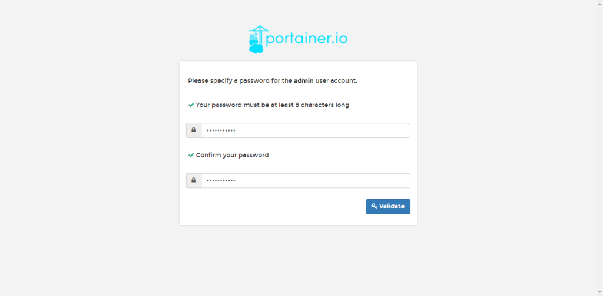
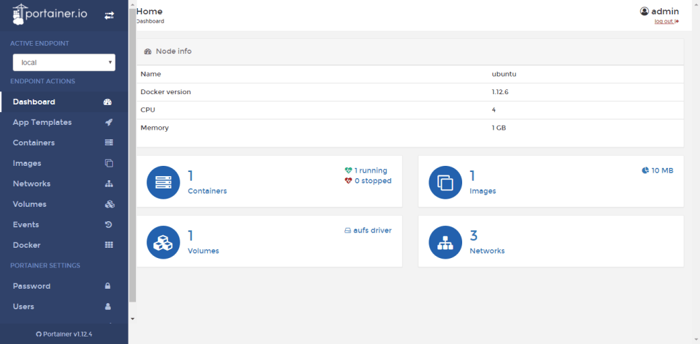

# Install portainer

If you need a GUI to manage your Docker on Manjaro, you may want to try Portainer. Portainer is an easy to use web management GUI for Docker. It was built on top of Docker, so it can be installed or run on any system as long as has Docker installed. This post is to test the Portainer installation on Manjaro.

The Portainer installation is pretty straight forward. It same as to run any docker container. Before attempting to install Portainer, make sure you have Docker installed on Manjaro.

Use the following command to download and run Portainer on Manjaro.

`docker run -d -p 9000:9000 -v /var/run/docker.sock:/var/run/docker.sock portainer/portainer`

Once completed, open web browser and type the Manjaro Ip address with the following format.

`http://localhost:9000`

Specify new password for the admin user

